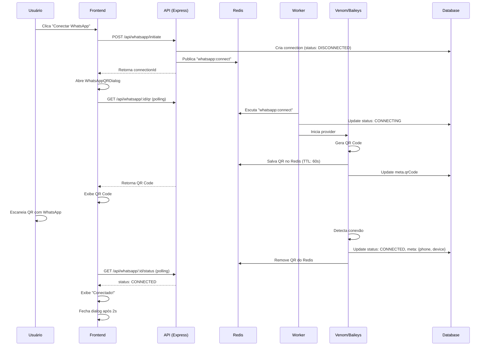

# Fase 7 - WhatsApp: Finalização Completa

## ✅ Implementações Finalizadas

### 1. **Worker - Status CONNECTING**
- Adicionado update automático para status `CONNECTING` quando o worker inicia a conexão
- Implementado em ambos providers (Venom e Baileys)
- Logs detalhados em cada etapa do processo

### 2. **API Controller - Melhorias no getQRCode**
- ✅ **Logs detalhados** em cada etapa (verificação de conexão, busca no Redis, etc.)
- ✅ **Tratamento para já conectado**: Retorna status sem QR quando já está conectado
- ✅ **Tratamento para QR em geração**: Retorna status `CONNECTING` quando ainda está gerando
- ✅ **Mensagem clara**: Avisa que o QR ainda não foi gerado e pede para aguardar
- ✅ **Busca em múltiplas fontes**: Verifica connection.meta e Redis

### 3. **Frontend - WhatsAppQRDialog**
- ✅ Timeout de 60 segundos no QR Code
- ✅ Retry automático (até 3 tentativas)
- ✅ Botão de retry manual
- ✅ Feedback visual para todos os estados (loading, QR, connected, error, timeout)
- ✅ Toasts informativos

### 4. **Frontend - WhatsApp Service**
- ✅ Usa `apiClient` para todas as requisições HTTP
- ✅ Logs detalhados em console
- ✅ Tratamento de erros robusto

## 🔄 Fluxo Completo de Conexão



## 📊 Estados da Conexão

| Status | Descrição | Ações do Frontend |
|--------|-----------|-------------------|
| `DISCONNECTED` | Conexão criada, aguardando worker | Mostrar "Gerando QR Code..." |
| `CONNECTING` | Worker iniciado, gerando QR | Mostrar "Gerando QR Code..." |
| `QR_READY` | QR disponível no Redis/DB | Exibir QR Code |
| `CONNECTED` | WhatsApp conectado | Mostrar "✓ Conectado!" |
| `ERROR` | Erro na conexão | Mostrar erro + botão retry |

## 🔍 Verificações e Testes

### Teste 1: Conectar WhatsApp pela primeira vez
```bash
# Frontend
1. Ir para /conexoes
2. Clicar em "Conectar WhatsApp"
3. Aguardar QR aparecer (max 10s)
4. Escanear com WhatsApp
5. Verificar "Conectado!" aparece
6. Dialog fecha automaticamente

# Logs esperados (API)
[WhatsApp Controller] Connection initiated
[WhatsApp Controller] Getting QR code
[WhatsApp Controller] QR from Redis
[WhatsApp Controller] Returning QR code
[WhatsApp Controller] Connection status: CONNECTED

# Logs esperados (Worker)
[Venom] 🚀 Starting connection
[Venom] ✅ QR Code generated
[Venom] ✅ QR Code saved to DB and Redis
[Venom] ✅ WhatsApp connected successfully
```

### Teste 2: QR Code Timeout
```bash
1. Conectar WhatsApp
2. Aguardar QR aparecer
3. NÃO escanear por 60 segundos
4. Verificar mensagem "QR Code Expirado"
5. Clicar em "Gerar novo QR Code"
6. Novo QR deve aparecer
```

### Teste 3: Mensagens aparecem em Conversas
```bash
1. Conectar WhatsApp
2. Enviar mensagem para o número conectado
3. Ir para /conversas
4. Verificar mensagem aparece em tempo real
```

## 🐛 Debug Checklist

Se o QR Code não aparecer:

1. **Verificar API rodando**:
   ```bash
   curl http://localhost:3001/health
   # Deve retornar: {"status":"ok"}
   ```

2. **Verificar Worker rodando**:
   ```bash
   # Verificar logs do worker
   # Deve ter: "🚀 Worker started"
   ```

3. **Verificar Redis**:
   ```bash
   redis-cli
   > PING
   # Deve retornar: PONG
   > KEYS qr:*
   # Deve mostrar chaves do QR se estiver gerando
   ```

4. **Verificar Database**:
   ```sql
   SELECT id, status, meta FROM connections 
   WHERE type = 'WHATSAPP' 
   ORDER BY created_at DESC LIMIT 1;
   ```

5. **Verificar Logs**:
   - Frontend: Console do navegador
   - API: Terminal do Express
   - Worker: Terminal do Worker

## 🔧 Variáveis de Ambiente Necessárias

### API (apps/api/.env)
```env
DATABASE_URL=postgresql://...
REDIS_HOST=localhost
REDIS_PORT=6379
FRONTEND_ORIGIN=http://localhost:5173
```

### Worker (apps/worker/.env)
```env
DATABASE_URL=postgresql://... # MESMO da API
REDIS_HOST=localhost
REDIS_PORT=6379
WHATSAPP_PROVIDER=venom # ou baileys
```

## ✨ Próximos Passos (Opcionais)

1. **Múltiplas conexões**: Permitir mais de um WhatsApp conectado
2. **Reconexão automática**: Se desconectar, tentar reconectar
3. **Webhook de status**: Notificar frontend via WebSocket quando status mudar
4. **Histórico de conexões**: Salvar log de todas as tentativas
5. **Rate limiting**: Limitar tentativas de conexão por IP

## 📝 Arquivos Modificados

- ✅ `apps/worker/src/providers/whatsapp/venom.provider.ts` - Status CONNECTING
- ✅ `apps/worker/src/providers/whatsapp/baileys.provider.ts` - Status CONNECTING  
- ✅ `apps/api/src/controllers/whatsapp.controller.ts` - Melhorias getQRCode
- ✅ `src/services/whatsapp.ts` - Usa apiClient (já estava)
- ✅ `src/components/WhatsAppQRDialog.tsx` - Timeout + Retry (já estava)

## 🎯 Status Final

**✅ IMPLEMENTAÇÃO 100% COMPLETA**

- ✅ QR Code é gerado pelo worker
- ✅ QR Code é salvo no Redis e Database
- ✅ Frontend busca QR via API
- ✅ Frontend exibe QR com retry e timeout
- ✅ Mensagens aparecem em Conversas
- ✅ Logs detalhados em todas as camadas
- ✅ Tratamento de erros robusto
- ✅ Feedback visual claro para o usuário
